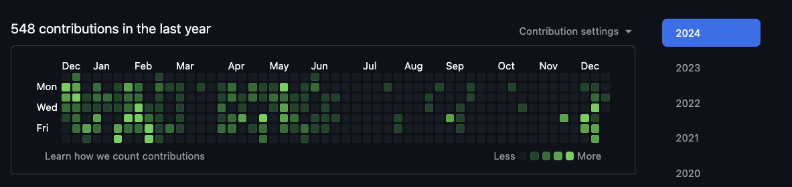
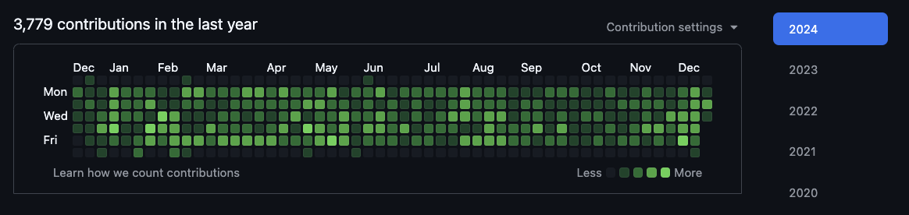

# git-gud

Fake your Github contributions.

> This is a meme repository.

It works by flooding the default branch with commits to generate contributions for the current year.

Note: I've been able to undo this in the past, but run it at your own risk.

### Before

### After

# Requirements
 - Golang

# How to run
 1. Create a new repo in your Github account and copy the origin url
 2. Clone this repo and go into the directory
 3. Remove current remote `git remote remove origin`
 4. Add your remote: `git remote add origin {your url}` (replace with url from step 1)
 3. Create a tag: `git tag anchor-tag`
 5. Run the code: `go run .`

Note: It won't work if you fork my repo ([Source](https://docs.github.com/en/account-and-profile/setting-up-and-managing-your-github-profile/managing-contribution-settings-on-your-profile/why-are-my-contributions-not-showing-up-on-my-profile#commit-was-made-in-a-fork))

Note2: It might take some time for the contributions to be updated.

# TODO
 - [ ] Add repo/path selection
 - [ ] Add date range selection
 - [ ] Add amount of commits selection
 - [ ] Add probabilities by day of week
 - [ ] Automatically detect default branch
 - [ ] ?

# Original

[git-gud](https://github.com/rafael1mc/git-gud)

# License
Check [LICENSE](https://github.com/rafael1mc/git-gud/blob/main/LICENSE) file.